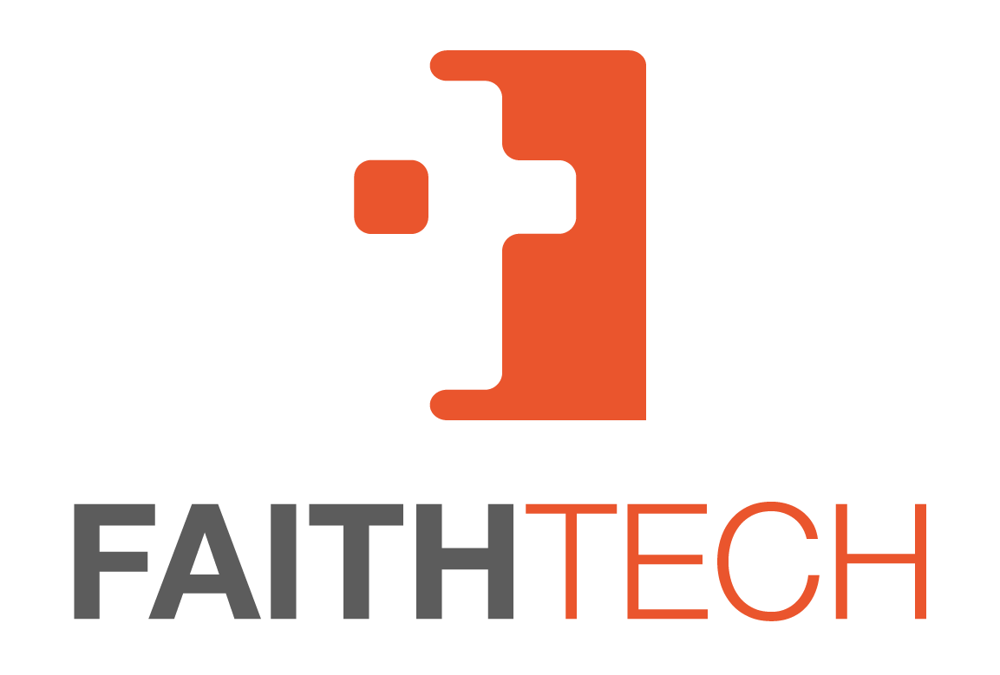

# FaithTech-Austria-Hackathon-2023

# Welcome to the first FaithTech Hackathon of the Austrian Community!

## Challenges

### Challenge 1: [Challenge Name]

#### Description

[Description of the challenge goes here...]

### Challenge 2: [Challenge Name]

#### Description

[Description of the challenge goes here...]

### Challenge 3: [Challenge Name]

#### Description

[Description of the challenge goes here...]

## How to Participate

To participate in the Hackathon, follow these steps:

1. [Step 1...]
2. [Step 2...]
3. [Step 3...]

## Resources

Here are some resources to help you get started:

- [Resource 1](https://example.com)
- [Resource 2](https://example.com)
- [Resource 3](https://example.com)

## Contact

If you have any questions or need further assistance, please reach out to us at [email address].

We can't wait to see the amazing projects you create during the Hackathon! Good luck and happy coding!
