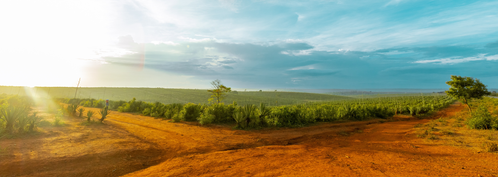

# Table of Contents
1. [Challenges](#challenges)
2. [How to participate](#how-to-participate)
3. [Contact](#contact)

## Challenges 

### Challenge 1: Kickstart the Songsheets Manager App 

Worship
Mixed Bands
Songsheet Management
App Development

#### Introduction
Interested in helping mixed bands work together more seamlessly?
If so, then help launch the Songsheets Manager app during this hackathon.
The Songsheet Manager app aims to be the go-to app for people who 
- Want to easily share songsheets with a mixed band
- want to do live updates
- Want to customise the songsheet without damaging the original data
Help develop Songsheets Manager, a tailor-made app for mixed bands that helps worship teams work together more easily.

#### Tasks
1. Screen design (mock-ups) and implementation in Flutter
2. Database modelling and implementation in Java Spring Boot

#### TechStack
Flutter App
Java Spring boot
MySQL Datenbank

#### Beneficiaries
- Worship bands (who play together regularly or sporadically)
- Basically any group of people who make music together

### Challenge 2: Supporting Permaculture Farming in Africa through Geospatial Data

CareofCreation Tanzania
Farming in Gods way
Geospatial Data
Web Maps
Data Apps

#### Introduction
The mission of CareofCreation Tanzania is to train people in the implementation of sustainable agriculture and forestry techniques. 
and forestry techniques to ensure sustainable development for people and their land.
When planning a new permaculture project they need geospatial data such as contour lines, wind and rain patterns, sunlight maps, buildings and roads to create permaculture design maps of the area of interest. 
Currently, the process of extracting and transforming the data is done manually, which is very time consuming. 
The challenge of the hackathon is to automate this process and think about ways to make the data accessible to users, such as CareofCreation.

#### Tasks
1. Identification of relevant & available data sources for permaculture farm design
2. Brainstorm on product architecture and deployment (ie desktop application vs web application)
3. Implementation of data extraction and transformation pipeline

#### TechStack
Date Extraction & Processing
Databases
Web Maps
APIs
GIS

#### Beneficiaries
- Care of Creation Tanzania
- People and Organizations who want to implement permaculture sites in Africa. 

### Challenge 3: How to utilize Language Models for the kingdom of God?

Natural Language Processing
Conversational AI
Large Language Models

#### Introduction
Specific challenge details are to be announced. 

## How to Participate 
To get more information and register for the Hackathon, 
checkout our [event page](https://www.eventbrite.com/e/faithtech-austria-hackathon-tickets-640764573087?aff=oddtdtcreator).

## Contact 
If you have any questions or need further assistance, please [contact us](mailto:david.robl@faithtech.com). \
We can't wait to see the amazing projects you create during the Hackathon! Good luck and happy coding!
